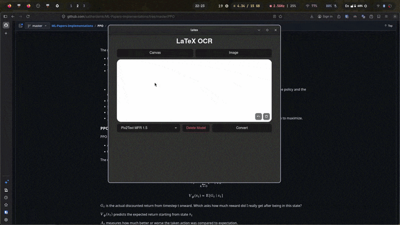

# LaTeX MFR

A desktop application for converting math formula images into LaTeX.

Draw on the canvas, drag & drop an image, paste from the clipboard, or upload a file. Then select a model and click convert. Results are rendered instantly with KaTeX and can be copied with one click.


## Demo




> **Note:** In my experience, Gemini provides more stable results for handwritten formula recognition.

## Models

- [Pix2Text MFR 1.5](https://huggingface.co/breezedeus/pix2text-mfr-1.5) — offline
- Gemini 2.5 Flash
- Gemini 2.5 Flash Lite
- Gemini 3 Flash Preview
- Gemini 3.1 Flash Lite Preview

You can use Gemini models with a free API key from: https://aistudio.google.com/api-keys


## Download

Prebuilt binaries will be provided for major platforms (Windows, macOS, Linux).


## Local Installation

### Requirements

- Rust  
- Bun (or Node.js)  
- Tauri CLI v2  

### Setup

```bash
bun install
```


### Development

```bash
bun tauri dev
```


### Build

```bash
bun tauri build
```
